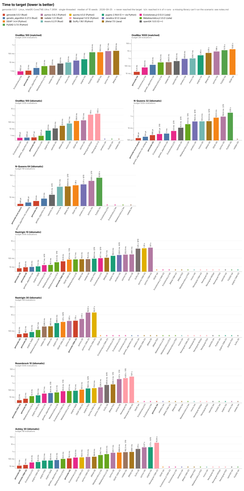
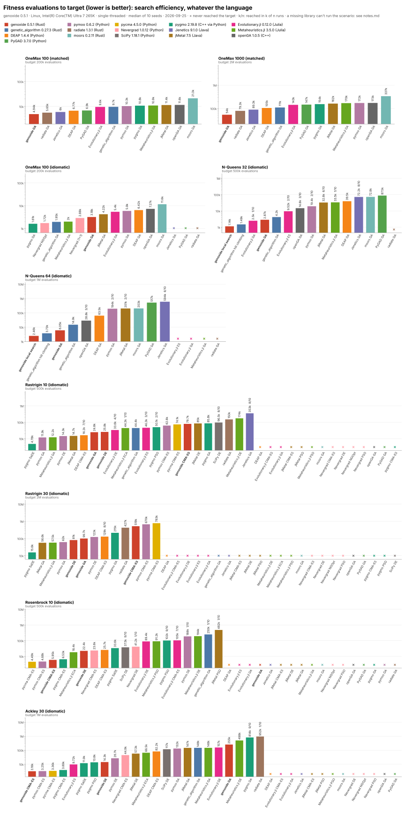
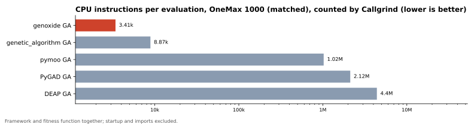
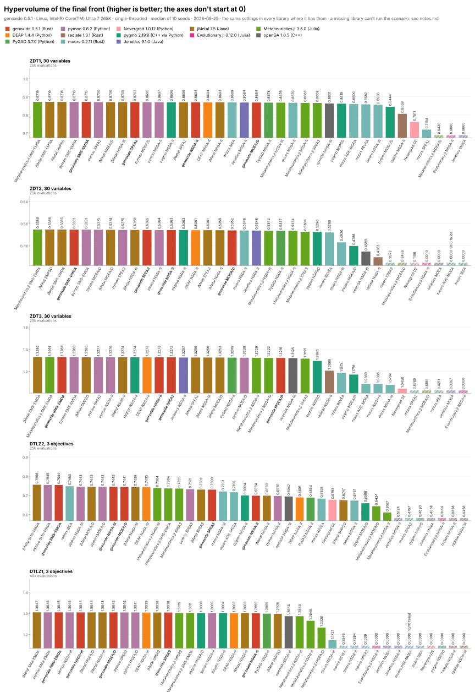
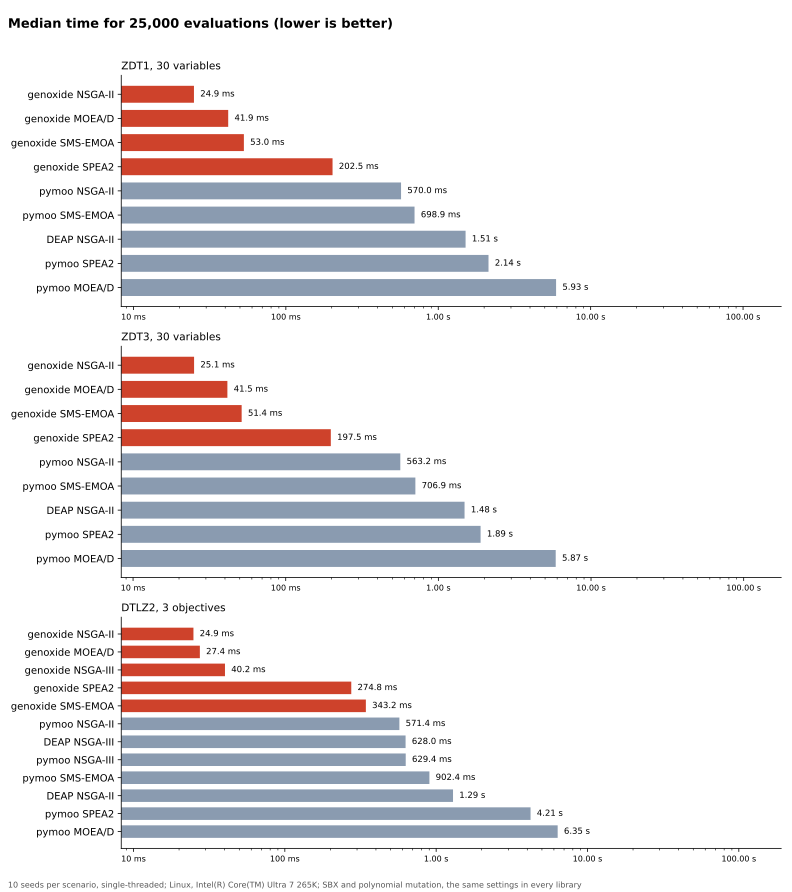

# genoxide

[](https://crates.io/crates/genoxide)
[](https://docs.rs/genoxide)
[](https://github.com/tachsin/genoxide/actions/workflows/ci.yml)
[](https://crates.io/crates/genoxide)
[](Cargo.toml)
[](src/lib.rs)
[](#license)

**Evolutionary computation for Rust: genetic algorithms, evolution strategies, differential evolution, particle swarms, local search and multi-objective optimization in one library.**

> **Pre-1.0:** the API changes between 0.x versions. See the [roadmap](ROADMAP.md), and share ideas in the issues.

```toml
[dependencies]
genoxide = "0.5"
```

## Benchmarks

genoxide against 15 other libraries in Rust, C++, Python, Java and Julia, on 9 single-objective and 5 multi-objective scenarios:
- **Rust:** genetic_algorithm, radiate, moors
- **C++:** openGA, pygmo (pagmo)
- **Python:** DEAP, pymoo, PyGAD, pycma, Nevergrad, SciPy
- **Java:** Jenetics, jMetal
- **Julia:** Evolutionary.jl, Metaheuristics.jl

Measured on 2026-09-25 with genoxide 0.5.1, on Linux with an Intel Core Ultra 7 265K, single-threaded, 10 seeds per scenario. The charts show medians.



- **Time to target:** genoxide is the fastest in 7 of the 9 single-objective scenarios:

  | Scenario | genoxide | Next fastest | DEAP |
  |---|---|---|---|
  | OneMax 1000 | 15 ms | 59 ms (Evolutionary.jl) | 15.8 s |
  | Rastrigin 30 | 39 ms | 70 ms (pygmo's SaDE) | 1.25 s (its CMA-ES, 8 of 10 runs) |
  | Ackley 30 | 11 ms | 30 ms (Evolutionary.jl's ES) | 0.7 s (its CMA-ES) |

  On OneMax 100, Evolutionary.jl's GA is slightly faster: 0.85 ms against 1.0 ms (matched), and 0.42 ms against 0.48 ms (idiomatic).
- **Cost per evaluation:** genoxide needs 3,400 CPU instructions per OneMax 1000 evaluation, fitness function included:
  - 2.6 times fewer than genetic_algorithm;
  - 10 to 19 times fewer than moors, openGA and radiate;
  - 90 to 1,300 times fewer than pygmo, pymoo, PyGAD and DEAP.
- **Evaluations to target:** genoxide needs the fewest in the matched OneMax scenarios, N-Queens and Ackley 30, but not everywhere:
  - **Rastrigin:** pygmo's SaDE needs about 5 times fewer (4,780 against genoxide's 24,782 on Rastrigin 10, and 15,570 against 81,000 on Rastrigin 30).
  - **Rosenbrock:** pycma's CMA-ES needs 4,491 against 5,945, and genoxide's GA doesn't reach the target.
  - **OneMax 100 (idiomatic):** pygmo needs 1,610 against 3,183.

  With an expensive fitness function, those libraries would win there.
- **Multi-objective:** with the same settings, genoxide's SMS-EMOA is within 0.0013 of the best hypervolume in all five scenarios. It ranks 3rd to 5th of 36 to 40 algorithm runs, and the best is the SMS-EMOA of jMetal or Metaheuristics.jl.
  - **Speed:** genoxide's NSGA-II takes 24 to 33 ms per run, against about 0.55 s for pymoo and 1.3 to 1.4 s for DEAP on ZDT1 and DTLZ2.
  - **moors:** only its NSGA-II is as fast, at 21 to 38 ms, with lower hypervolumes in all five scenarios. They're far lower on ZDT3 and DTLZ1. moors evaluates its parents again every generation, so the same budget gives it half the generations.

How they're measured:
- **The same problems:** every library gets the same fitness functions, written in its own language and checked against a reference, and the same evaluation budget.
- **Time:** measured inside the process, around the optimization only. Interpreter or JVM startup, imports and JIT warm-up aren't included.
- **Matched and idiomatic:** "matched" configurations are as equal as the libraries allow, and "idiomatic" ones are what each library recommends.
- **Time to target** is the number of evaluations times the cost of an evaluation:
  - The evaluations to target measure the search itself, whatever the language.
  - The CPU instructions per evaluation measure the framework's cost.
  - With a cheap fitness function, time mostly shows the framework's cost. With an expensive one, only the evaluations count.

The full methodology, every library's settings, and the bugs we found in the libraries are in [benchmarks/README.md](benchmarks/README.md). The numbers behind the charts are in [docs/benchmarks/results.md](docs/benchmarks/results.md).

<details>
<summary>More charts: evaluations to target, instructions per evaluation, multi-objective runs</summary>









</details>

## Why genoxide?

| | What it means |
|---|---|
| **Complete** | From a simple GA to NSGA-III, CMA-ES with restarts, L-SHADE and island models, see [what's there](#whats-there-so-far) |
| **Fast** | Compiled Rust, bit-packed binary genomes, and parallel or batch evaluation. Measured against 15 libraries [above](#benchmarks), and guarded in CI: a PR that adds more than 5% instructions to a hot path fails ([gungraun](https://github.com/gungraun/gungraun)) |
| **Correct** | Invalid settings are errors from `build()`, before anything runs. An operator that doesn't fit the genome is a compile error |
| **Reproducible** | The same seed gives the same result, on any number of threads and on 32 or 64 bits: the random numbers and math are portable, and tests pin their values |
| **Safe** | `#![forbid(unsafe_code)]`: memory safety from the compiler, and parallel code without data races |
| **Also for Python** | A Python package with numpy genomes and vectorized fitness functions, in [`python/`](python/). `pip install genoxide` comes with 0.6 |
| **Batteries included** | Statistics, hall of fame, progress reports, constraints, checkpoints to resume a run, cancellation, `tracing` |

## A first look

```rust
use genoxide::prelude::*;

fn main() -> genoxide::Result<()> {
    // OneMax: find the 100-bit string with the most ones
    let ga = Ga::builder(Binary::new(100)?)
        .population_size(100)
        .select(Tournament::new(3)?)
        .crossover(UniformCrossover::new())
        .mutate(BitFlip::per_gene(0.01)?)
        .seed(42)
        .build()?;

    let outcome = Engine::new(ga, |genome: &Bits| genome.count_ones() as f64)
        .stop_when(Stop::target(100.0).or(Stop::generations(1_000)))
        .run()?;

    println!("best: {} after {} generations", outcome.best_fitness(), outcome.generations());
    Ok(())
}
```

A missing operator, or one that doesn't fit the genome, is a compile error that says what to set. Invalid settings are errors from `build()`, before anything runs.

### What's there so far

- **Genomes:** binary (bit-packed), integer and real (bounded per gene), permutation, and real with a self-adaptive step size
- **Selection:** tournament, roulette, stochastic universal sampling, rank, truncation, random
- **Crossover:** one-point, two-point, k-point, uniform; for real genomes SBX, blend (BLX-α), arithmetic; for permutations order (OX1), partially mapped (PMX), cycle (CX), edge recombination
- **Mutation:** bit-flip, uniform, Gaussian, polynomial, self-adaptive Gaussian; for permutations swap, inversion (2-opt), insertion, scramble (per-gene rates are exact; a picked gene always changes)
- **Schemes:** generational with elitism, steady-state, (μ+λ), (μ,λ), and memetic (Lamarckian local search on the best parents)
- **Evolution strategies:** (μ/ρ +, λ)-ES with intermediate or dominant recombination and self-adapted step sizes (one, or one per gene)
- **CMA-ES:** covariance matrix adaptation with Hansen's defaults and stop criteria, IPOP and BIPOP restarts, sep-CMA-ES (diagonal) for high dimensions, portable (a Householder and QL eigendecomposition)
- **Differential evolution:** rand/1, best/1 and current-to-pbest/1 with an archive; fixed, dithered or adaptive parameters (JADE, SHADE, L-SHADE)
- **Particle swarm optimization:** global or ring topology, constriction coefficients, velocity limits
- **Multi-objective:** NSGA-II, NSGA-III (reference directions, pymoo's normalization) SPEA2, MOEA/D (Tchebycheff, PBI) and SMS-EMOA, with constrained dominance, duplicate elimination, O(N log N) non-dominated sorting for 2 objectives (ENS-BS for more), crowding distance, a Pareto archive; the number of objectives is checked at compile time; indicators: exact hypervolume and hypervolume contributions, IGD, IGD+, GD, generalized spread; the ZDT and DTLZ test problems
- **Asynchronous evaluation:** a steady-state GA whose workers each get a new genome as soon as they're done, for slow fitness functions whose time varies
- **Island model:** GA or DE islands with ring, fully connected or random migration; evaluated together, deterministic with any number of threads
- **Local search:** hill climbing (first-improvement or best-of-k, with plateau moves), simulated annealing, tabu search and iterated local search, with any mutation as the neighborhood
- **Constraints:** Deb's feasibility rules (a fitness function returns a score and a constraint violation), and penalty functions
- **Engine:** ask / tell core, stop conditions (target, generations, evaluations, time, stagnation, custom, combined), parallel evaluation with the same results as sequential, batch evaluation (a whole generation in one call, for SIMD, GPUs or remote services), abort flag, NaN policy, checkpoints to resume a run exactly (`serde` feature)
- **Observers:** statistics per generation, hall of fame, progress lines, closures; `tracing` spans and events behind the `tracing` feature

### Examples

```text
cargo run --release --example one_max     # binary, statistics
cargo run --release --example knapsack    # a constraint with Deb's feasibility rules, hall of fame
cargo run --release --example n_queens    # permutation, (μ+λ)
cargo run --release --example rastrigin   # real-valued, parallel evaluation
cargo run --release --example asynchronous # a slow fitness function, asynchronous evaluation
cargo run --release --manifest-path examples/gpu/Cargo.toml  # neuroevolution on the GPU, with wgpu
```

### Without writing Rust

The `genoxide` program runs an optimization described in a TOML or JSON file. The fitness function is any program, in any language, that reads a genome per line and writes its fitness:

```text
cargo install genoxide --features cli
genoxide run sphere.toml
```

See [docs/cli.md](docs/cli.md) for the run file and the protocol.

### From Python

The Python package, in [`python/`](python/), runs genoxide's algorithms with fitness functions in Python and numpy: a genome at a time, a whole generation in one call for vectorized code, or from several threads.

```python
import genoxide as gx

ga = gx.Ga(
    gx.Binary(100),
    population_size=100,
    select=gx.Tournament(3),
    crossover=gx.UniformCrossover(),
    mutation=gx.BitFlip(rate=0.01),
    seed=42,
)
result = ga.run(lambda bits: bits.sum(), target=100, generations=1_000)
```

It isn't on PyPI yet: build it with `maturin develop --release` in `python/`.

Using an AI coding assistant? Point it to [AGENTS.md](AGENTS.md): it has the decision tables, settings, templates and fixes for common errors.

## Status

| Milestone | Scope | Status |
|---|---|---|
| 0.1 Foundations | Core engine, representations, classic operators, statistics | ✅ released |
| 0.2 Real-valued & permutations | SBX, polynomial, PMX, OX, 2-opt, local search, memetic | ✅ released |
| 0.3 Evolution strategies & swarm | CMA-ES, DE (JADE, SHADE), PSO, (μ,λ) and (μ+λ)-ES | ✅ released |
| 0.4 Multi-objective | NSGA-II/III, SPEA2, MOEA/D, SMS-EMOA, hypervolume | ✅ released |
| 0.5 Scale | Island model, checkpointing, batch/GPU and asynchronous evaluation, CLI | ✅ released |
| 0.6 Python | PyO3 bindings with numpy support | 🚧 in progress |
| 0.7 GP & neuroevolution | Typed tree GP, NEAT | planned |
| 0.8 Frontier | Quality-diversity (MAP-Elites), LLM-guided operators | planned |
| 1.0 | Stable API and published benchmark report | planned |

The details are in [ROADMAP.md](ROADMAP.md).

## Contributing

genoxide is at an early stage, which is the best time to shape it. Open an issue for ideas, use cases or API feedback, and see [CONTRIBUTING.md](CONTRIBUTING.md) for pull requests, versioning and releases.

## License

Licensed under either of [Apache License, Version 2.0](LICENSE-APACHE) or [MIT license](LICENSE-MIT) at your option.

Unless you explicitly state otherwise, any contribution intentionally submitted for inclusion in genoxide by you, as defined in the Apache-2.0 license, shall be dual licensed as above, without any additional terms or conditions.
