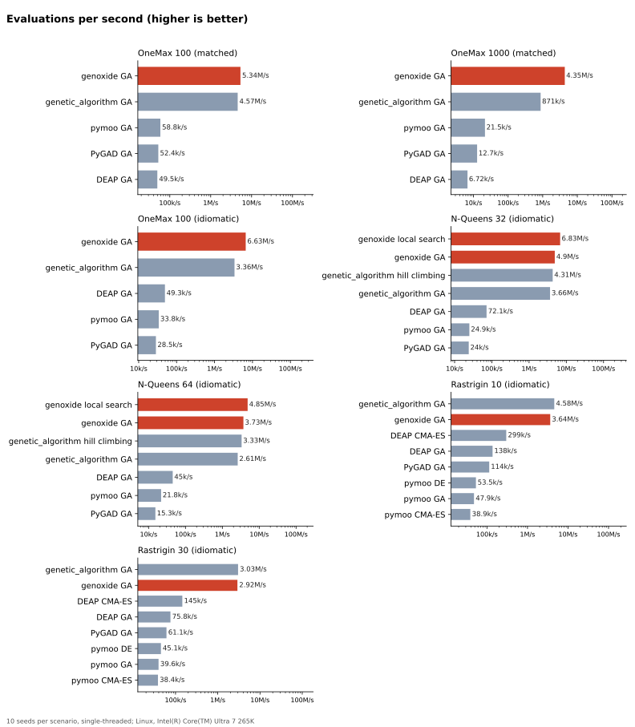

# genoxide

**Evolutionary computation for Rust (and Python): fast, correct, reproducible.**

Genetic algorithms, evolution strategies, multi-objective optimization, swarm and local search, all in one library.

> **🚧 Early days.** 0.5 is out: the genetic algorithm with operators for binary, integer,
> real-valued and permutation problems, local search, constraint handling, CMA-ES, differential
> evolution, particle swarm, evolution strategies, multi-objective optimization (NSGA-II,
> NSGA-III, SPEA2, MOEA/D, SMS-EMOA), island models, batch and asynchronous evaluation,
> checkpoints, and the `genoxide` program for runs described in TOML or JSON files. The API will
> change between 0.x versions. See the [roadmap](ROADMAP.md) and share your ideas in the issues.

```toml
[dependencies]
genoxide = "0.5"
```

## Why genoxide?

Rust has over 200 evolutionary computation crates, but most are small or abandoned. None of them covers what DEAP or pymoo offer in Python. Python has the breadth, but every operator runs in the interpreter. genoxide aims to combine both:

- **Complete:** one library, from a simple GA to NSGA-III, CMA-ES and island models
- **Fast:** native Rust, parallel evaluation, no allocations in the hot loop
- **Correct:** configurations are validated when you build them, and operators are checked against the representation at compile time
- **Reproducible:** the same seed gives the same result, on any number of threads
- **Batteries included:** statistics, hall of fame, checkpointing, cancellation, benchmarks
- **Also for Python:** `pip install genoxide`, planned

## Why Rust

genoxide is built to show what Rust brings to evolutionary computation. Every claim below will be measured or enforced, not just promised:

| | What Rust gives | How genoxide shows it |
|---|---|---|
| **Speed** | Native code, zero-cost abstractions, no garbage collector, SIMD | Wall-time and instruction-count benchmarks (Callgrind) against the most used libraries in every language |
| **Memory** | Compact data without per-object overhead | Bit-packed genomes, no allocations in the generation loop, measured peak memory |
| **Fearless parallelism** | Data races are compile errors | Parallel evaluation, islands and batch fitness that are both safe and deterministic |
| **Safety** | Memory safety, strong types | Invalid configurations and operator/genome mismatches are errors before the run starts; no panics in library code |
| **Reproducibility** | Explicit ownership of state and rng | The same seed gives bit-for-bit the same result, on any number of threads |

## A first look

```rust
use genoxide::prelude::*;

fn main() -> genoxide::Result<()> {
    // OneMax: find the 100-bit string with the most ones
    let ga = Ga::builder(Binary::new(100)?)
        .population_size(100)
        .select(Tournament::new(3)?)
        .crossover(UniformCrossover::new())
        .mutate(BitFlip::per_gene(0.01)?)
        .seed(42)
        .build()?;

    let outcome = Engine::new(ga, |genome: &Bits| genome.count_ones() as f64)
        .stop_when(Stop::target(100.0).or(Stop::generations(1_000)))
        .run()?;

    println!("best: {} after {} generations", outcome.best_fitness(), outcome.generations());
    Ok(())
}
```

A missing operator, or one that doesn't fit the genome, is a compile error that says what to set. Invalid settings are errors from `build()`, before anything runs.

### What's there so far

- **Genomes:** binary (bit-packed), integer and real (bounded per gene), permutation, and real with a self-adaptive step size
- **Selection:** tournament, roulette, stochastic universal sampling, rank, truncation, random
- **Crossover:** one-point, two-point, k-point, uniform; for real genomes SBX, blend (BLX-α), arithmetic; for permutations order (OX1), partially mapped (PMX), cycle (CX), edge recombination
- **Mutation:** bit-flip, uniform, Gaussian, polynomial, self-adaptive Gaussian; for permutations swap, inversion (2-opt), insertion, scramble (per-gene rates are exact; a picked gene always changes)
- **Schemes:** generational with elitism, steady-state, (μ+λ), (μ,λ), and memetic (Lamarckian local search on the best parents)
- **Evolution strategies:** (μ/ρ +, λ)-ES with intermediate or dominant recombination and self-adapted step sizes (one, or one per gene)
- **CMA-ES:** covariance matrix adaptation with Hansen's defaults and stop criteria, IPOP and BIPOP restarts, sep-CMA-ES (diagonal) for high dimensions, portable (a Householder and QL eigendecomposition)
- **Differential evolution:** rand/1, best/1 and current-to-pbest/1 with an archive; fixed, dithered or adaptive parameters (JADE, SHADE, L-SHADE)
- **Particle swarm optimization:** global or ring topology, constriction coefficients, velocity limits
- **Multi-objective:** NSGA-II, NSGA-III (reference directions, pymoo's normalization) SPEA2, MOEA/D (Tchebycheff, PBI) and SMS-EMOA, with constrained dominance, O(N log N) non-dominated sorting for 2 objectives (ENS-BS for more), crowding distance, a Pareto archive; the number of objectives is checked at compile time; indicators: exact hypervolume and hypervolume contributions, IGD, IGD+, GD, generalized spread; the ZDT and DTLZ test problems
- **Asynchronous evaluation:** a steady-state GA whose workers each get a new genome as soon as they're done, for slow fitness functions whose time varies
- **Island model:** GA or DE islands with ring, fully connected or random migration; evaluated together, deterministic with any number of threads
- **Local search:** hill climbing (first-improvement or best-of-k, with plateau moves), simulated annealing, tabu search and iterated local search, with any mutation as the neighborhood
- **Constraints:** Deb's feasibility rules (a fitness function returns a score and a constraint violation), and penalty functions
- **Engine:** ask / tell core, stop conditions (target, generations, evaluations, time, stagnation, custom, combined), parallel evaluation with the same results as sequential, batch evaluation (a whole generation in one call, for SIMD, GPUs or remote services), abort flag, NaN policy, checkpoints to resume a run exactly (`serde` feature)
- **Observers:** statistics per generation, hall of fame, progress lines, closures; `tracing` spans and events behind the `tracing` feature

### Examples

```text
cargo run --release --example one_max     # binary, statistics
cargo run --release --example knapsack    # a constraint with Deb's feasibility rules, hall of fame
cargo run --release --example n_queens    # permutation, (μ+λ)
cargo run --release --example rastrigin   # real-valued, parallel evaluation
cargo run --release --example asynchronous # a slow fitness function, asynchronous evaluation
cargo run --release --manifest-path examples/gpu/Cargo.toml  # neuroevolution on the GPU, with wgpu
```

### Without writing Rust

The `genoxide` program runs an optimization described in a TOML or JSON file. The fitness function is any program, in any language, that reads a genome per line and writes its fitness:

```text
cargo install genoxide --features cli
genoxide run sphere.toml
```

See [docs/cli.md](docs/cli.md) for the run file and the protocol.

Using an AI coding assistant? Point it to [AGENTS.md](AGENTS.md): it has the decision tables, settings, templates and fixes for common errors.

## Status

| Milestone | Scope | Status |
|---|---|---|
| 0.1 Foundations | Core engine, representations, classic operators, statistics | ✅ released |
| 0.2 Real-valued & permutations | SBX, polynomial, PMX, OX, 2-opt, local search, memetic | ✅ released |
| 0.3 Evolution strategies & swarm | CMA-ES, DE (JADE, SHADE), PSO, (μ,λ) and (μ+λ)-ES | ✅ released |
| 0.4 Multi-objective | NSGA-II/III, SPEA2, MOEA/D, SMS-EMOA, hypervolume | ✅ released |
| 0.5 Scale | Island model, checkpointing, batch/GPU and asynchronous evaluation, CLI | ✅ released |
| 0.6 Python | PyO3 bindings with numpy support | 🔜 next |
| 0.7 GP & neuroevolution | Typed tree GP, NEAT | planned |
| 0.8 Frontier | Quality-diversity (MAP-Elites), LLM-guided operators | planned |
| 1.0 | Stable API and published benchmark report | planned |

The details are in [ROADMAP.md](ROADMAP.md).

## Benchmarks

Every release will be benchmarked against the most used evolutionary computation libraries in every language:
- Python: DEAP, pymoo, PyGAD, EvoX, Nevergrad, pycma
- Java: Jenetics, jMetal
- C++: pagmo, openGA
- C#: GeneticSharp
- Julia: Evolutionary.jl
- Rust: radiate, moors, genetic_algorithm

They all use the same problems, the same fitness functions and the same evaluation budgets. The results will be published with graphs:

- **Time to target and success rate:** does it solve the problem, and how fast?
- **Evaluations to target:** how efficient is the search itself, independent of language?
- **Instructions per evaluation (Callgrind):** exact, noise-free framework cost, comparable across languages.
- **Peak memory**

genoxide's own performance is guarded in CI with [gungraun](https://github.com/gungraun/gungraun) (formerly iai-callgrind) instruction-count benchmarks: every PR shows its effect on the hot paths, and more than 5% more instructions fails CI.

### Results

Linux, Intel Core Ultra 7 265K, single-threaded, 10 seeds per scenario, genoxide at the 0.4 development version. Every library runs with the same fitness functions and evaluation budgets, in the configurations described in [`benchmarks/`](benchmarks/): "matched" as equal as the libraries allow, "idiomatic" as each library recommends. The numbers behind the charts are in [docs/benchmarks/results.md](docs/benchmarks/results.md).





- **Cost per evaluation:** genoxide needs about 3,300 CPU instructions per OneMax 1000 evaluation, fitness function included: 2.7 times fewer than genetic_algorithm, and 300 to 1,300 times fewer than pymoo, PyGAD and DEAP.
- **Time to target:** genoxide is the fastest in every single-objective scenario, and level with genetic_algorithm on OneMax 100 (idiomatic), at 0.45 ms each:
  - **OneMax 1000 (matched):** 15 ms, against 127 ms for genetic_algorithm.
  - **N-Queens:** its local search beats every other solver.
  - **Rastrigin 10 and 30:** its GA takes 6 ms and 35 ms and its differential evolution (SHADE, without tuning) 8 ms and 40 ms, against 11 ms for genetic_algorithm on Rastrigin 10 and 1.7 s for pymoo's GA on Rastrigin 30.
- **Evaluations to target:** on Rastrigin 30, genoxide's DE needs 80,000 evaluations and its GA 103,000, against 65,000 for pymoo's GA, the most efficient there, and 104,000 for pymoo's DE. On Rastrigin 10, pymoo needs about half as many: 11,700 (GA) and 15,000 (DE), against 22,700 for genoxide's GA and 25,750 for its DE. genoxide's CMA-ES with IPOP restarts needs about 25% more evaluations than pymoo's, which restarts from the best solution instead of a random point. With an expensive fitness function, the evaluations count more than the framework's speed.
- **Multi-objective:** with the same operators and settings, genoxide's fronts match pymoo's in hypervolume within 0.003 on ZDT1, ZDT3 and DTLZ2, with NSGA-II, NSGA-III, SPEA2 and SMS-EMOA; its batch MOEA/D is up to 0.0023 behind pymoo's sequential one. genoxide takes 2.6 to 140 times less time than pymoo: 25 ms against 570 ms for NSGA-II on ZDT1, 42 ms against 5.9 s for MOEA/D, and 0.34 s against 0.9 s for SMS-EMOA on DTLZ2, where both compute hypervolume contributions in compiled code. SMS-EMOA gives the best fronts in both libraries.

## Contributing

genoxide is at an early stage, which is the best time to shape it. Open an issue for ideas, use cases or API feedback, and see [CONTRIBUTING.md](CONTRIBUTING.md) for pull requests, versioning and releases.

## License

Licensed under either of [Apache License, Version 2.0](LICENSE-APACHE) or [MIT license](LICENSE-MIT) at your option.

Unless you explicitly state otherwise, any contribution intentionally submitted for inclusion in genoxide by you, as defined in the Apache-2.0 license, shall be dual licensed as above, without any additional terms or conditions.
