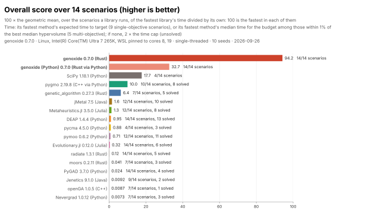

<p align="center">
  
</p>

[](https://crates.io/crates/genoxide)
[](https://pypi.org/project/genoxide/)
[](https://docs.rs/genoxide)
[](https://github.com/tachsin/genoxide/actions/workflows/ci.yml)
[](#license)
[](https://tachsin.gr/projects/genoxide/benchmarks)

**Evolutionary computation for Rust: genetic algorithms, evolution strategies, differential evolution, particle swarms, local search and multi-objective optimization in one library.**

## Install

```toml
[dependencies]
genoxide = "0.7"
```

```rust
use genoxide::prelude::*;

fn main() -> genoxide::Result<()> {
    // OneMax: find the 100-bit string with the most ones
    let ga = Ga::builder(Binary::new(100)?)
        .population_size(100)
        .select(Tournament::new(3)?)
        .crossover(UniformCrossover::new())
        .mutate(BitFlip::per_gene(0.01)?)
        .seed(42)
        .build()?;

    let outcome = Engine::new(ga, |genome: &Bits| genome.count_ones() as f64)
        .stop_when(Stop::target(100.0).or(Stop::generations(1_000)))
        .run()?;

    println!("best: {} after {} generations", outcome.best_fitness(), outcome.generations());
    Ok(())
}
```

## What's in it

- **Genomes:** binary (bit-packed), integer, real, permutation, and real with a self-adaptive step size.
- **Genetic algorithms:** generational, steady-state, (μ+λ), (μ,λ) and memetic schemes, with the classic operators.
- **Evolution strategies, CMA-ES, differential evolution, particle swarms:** with IPOP and BIPOP restarts, JADE, SHADE and L-SHADE.
- **Local search:** hill climbing, simulated annealing, tabu search, iterated local search.
- **Multi-objective:** NSGA-II, NSGA-III, SPEA2, MOEA/D and SMS-EMOA, with quality indicators.
- **Test problems:** classic continuous functions such as Rastrigin, Rosenbrock and Branin, with their bounds, known optima and references; constrained ones, CEC 2006's g01-g06 and engineering designs such as the welded beam and the pressure vessel; multi-objective ones such as ZDT, DTLZ and the constrained BNH and OSY, with their optimal fronts.
- **Engine:** parallel, batch and asynchronous evaluation, island models, constraints, checkpoints, reproducible seeds.
- **Beyond Rust:** a Python package, and a [command-line program](docs/cli.md) for fitness functions in any language.

The full list is in [docs/features.md](docs/features.md).

## Python

`pip install genoxide`: wheels for Linux, macOS and Windows, CPython 3.10 and later.

```python
import genoxide as gx

ga = gx.Ga(gx.Binary(100), population_size=100, select=gx.Tournament(3),
           crossover=gx.UniformCrossover(), mutation=gx.BitFlip(rate=0.01), seed=42)
result = ga.run(lambda bits: bits.sum(), target=100, generations=1_000)
```

See [python/README.md](python/README.md) for the algorithms, operators and numpy fitness functions.

## Benchmarks

genoxide and its Python package are benchmarked with 15 other libraries in Rust, C++, Python, Java and Julia, on 14 scenarios under the same public [rules](docs/benchmarks/rules.md): single-threaded on the same machine, 10 seeds each.

[](https://tachsin.gr/projects/genoxide/benchmarks)

Per scenario, the fastest library gets 100 points and a library that doesn't solve it within the time cap 0, evenly per order of magnitude of time in between; the overall score is the mean over the scenarios a library runs ([rule 8.5](docs/benchmarks/rules.md#8-reporting)). A library's time is its fastest method's expected time to the target, or, with several objectives, its fastest method's time for the budget among those within 1% of the best hypervolume.

genoxide's own releases are compared on the same runs by the CPU instructions Callgrind counts, exact whatever the machine's load: [genoxide_versions.svg](docs/benchmarks/genoxide_versions.svg) ([rule 10](docs/benchmarks/rules.md#10-instruction-counts-genoxides-versions)).

**Interactive results, every chart and table: [tachsin.gr/projects/genoxide/benchmarks](https://tachsin.gr/projects/genoxide/benchmarks).** The [methodology](benchmarks/README.md) and the [page for each library](docs/benchmarks/libraries/) give the methods and settings, and [results.md](docs/benchmarks/results.md) has the full tables.

## Links

- Docs and examples: https://tachsin.github.io/genoxide/
- [examples/](examples/): the same programs in Rust and Python, from OneMax to TSPLIB, job shop scheduling and NSGA-III
- [tachsin.gr/projects/genoxide/examples](https://tachsin.gr/projects/genoxide/examples): each example's run played back, with charts made for its problem
- [API documentation](https://docs.rs/genoxide) on docs.rs
- [docs/features.md](docs/features.md): the full feature list and the examples
- [AGENTS.md](AGENTS.md): a guide for AI coding assistants
- [ROADMAP.md](ROADMAP.md): what's planned
- [docs/cli.md](docs/cli.md): the `genoxide` program
- [tachsin.gr/projects/genoxide/benchmarks](https://tachsin.gr/projects/genoxide/benchmarks): the benchmark results, interactive
- [Benchmarks](docs/benchmarks/): rules, methodology and results
- [CONTRIBUTING.md](CONTRIBUTING.md): pull requests and releases

## Status

Alpha, pre-1.0: the API may change between 0.x versions. See the [roadmap](ROADMAP.md).

## License

Licensed under either of [Apache License, Version 2.0](LICENSE-APACHE) or [MIT license](LICENSE-MIT) at your option.

Unless you explicitly state otherwise, any contribution intentionally submitted for inclusion in genoxide by you, as defined in the Apache-2.0 license, shall be dual licensed as above, without any additional terms or conditions.
