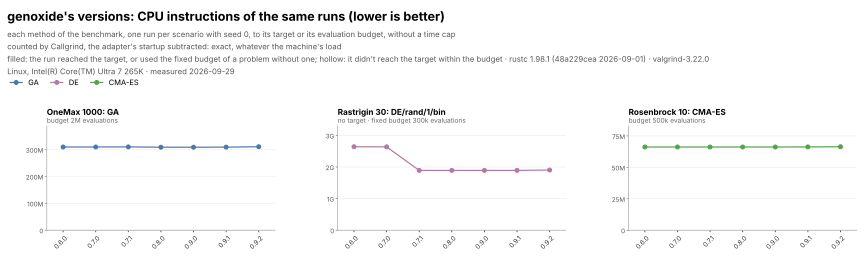

# Benchmarks

A small, matched suite: three problems, one method each, and every library runs a problem only with its own implementation of that problem's method, set to the same written definition ([rule 6](rules.md#6-the-methods)). genoxide and its Python package run all three.

| Problem | Method |
|---|---|
| OneMax 1000 | a GA: DEAP's `eaSimple`, 300 individuals, tournaments of 3, two-point crossover, bit flip, no elitism |
| Rastrigin 30, shifted | DE/rand/1/bin: 100 individuals, F 0.5, CR 0.9, no adaptation or restarts; no target, a fixed budget of 300,000 evaluations, measured by the time for it and the error at the end |
| Rosenbrock 10 | CMA-ES with Hansen's defaults, no restarts (pycma is the reference) |

**Why so small.** Comparing each library's fastest pick among many methods said little about any library: a library with a method that suits a problem beat one without it, and nothing checked whether either implementation was right. Running the same algorithm everywhere compares implementations: their speed, their evaluations to the target, and whether they do what the definition says. Where a library can't be set exactly to a definition, its page says how it differs, and a difference that changes the algorithm leaves it out of that problem. More problems, and multi-objective ones, come back after these.

The published run predates the matched suite: its OneMax 1000 runs are the suite's GA and are shown; Rastrigin 30 and Rosenbrock 10 await the next run.

genoxide's own releases are compared on the same runs by the CPU instructions Callgrind counts: one seeded run of each method per problem, exact whatever the machine's load ([rule 10](rules.md#10-instruction-counts-genoxides-versions), history in [genoxide-versions.json](genoxide-versions.json)).

**Interactive results, a card per problem: [tachsin.gr/projects/genoxide/benchmarks](https://tachsin.gr/projects/genoxide/benchmarks).**

| Page | What it has |
|---|---|
| [Methodology](../../benchmarks/README.md) | the libraries and which problems they run, the protocol, how to run it |
| [Rules](rules.md) | the rules every adapter follows, the three methods' definitions, and which rules `run.py check` tests |
| [Notes](notes.md) | what each library can't run, how each differs from the definitions, the bugs found |
| [Results](results.md) | the charts and full numbers of the published run, and its runs in [results.json.xz](results.json.xz), from which `run.py chart` redraws them |

Each library has its own page: its configuration against each definition, its differences, what it can't run, its separate test runs and its bugs.

Libraries: [genoxide](libraries/genoxide.md) (Rust), [genoxide (Python)](libraries/genoxide_python.md) (Rust via Python), [DEAP](libraries/deap.md) (Python), [PyGAD](libraries/pygad.md) (Python), [radiate](libraries/radiate.md) (Rust), [pycma](libraries/pycma.md) (Python), [SciPy](libraries/scipy.md) (Python), [pygmo](libraries/pygmo.md) (C++ via Python), [pymoo](libraries/pymoo.md) (Python), [jMetal](libraries/jmetal.md) (Java), [Evolutionary.jl](libraries/evolutionary_jl.md) (Julia), [Metaheuristics.jl](libraries/metaheuristics_jl.md) (Julia).
