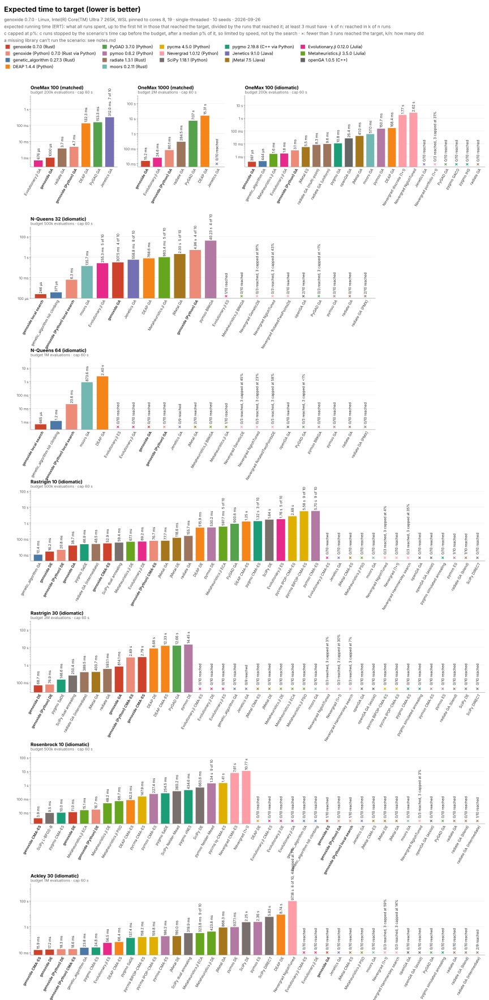

# Results 20260929-025403

The matched suite: three problems, one method each, the same in every library, with its own implementation ([rule 6](rules.md#6-the-methods)).

Seeds per scenario: 10, wall time cap per run: 60 s
Linux, Intel(R) Core(TM) Ultra 7 265K, WSL pinned to cores 8, 19

- genoxide 0.9.2+cc16f70
- genoxide_python 0.9.2+cc16f70
- deap 1.4.4
- pygad 3.7.0
- pymoo 0.6.2
- radiate 1.3.2
- pycma 4.5.0
- scipy 1.18.1
- pygmo 2.19.8
- jmetal 7.5
- evolutionary_jl 0.12.1
- metaheuristics_jl 3.5.0

Invalid runs, left out of every table and chart: 0

## Charts

Interactive, with each bar's numbers and runs: [tachsin.gr/projects/genoxide/benchmarks](https://tachsin.gr/projects/genoxide/benchmarks).

- [Expected evaluations to target](evaluations_to_target.svg)
- [Distance to the optimum at the end](distance_to_optimum.svg)
- [genoxide's versions](genoxide_versions.svg): the CPU instructions of the same runs in each release, genoxide only ([rule 10](rules.md#10-instruction-counts-genoxides-versions))

## Coverage

✓ ran, ✗ every run invalid, – can't run the scenario's method: why, and the bugs found in the libraries, in [notes.md](notes.md).

| Library | OneMax 1000: GA | Rastrigin 30: DE/rand/1/bin | Rosenbrock 10: CMA-ES |
|---|---|---|---|
| genoxide | ✓ | ✓ | ✓ |
| genoxide (Python) | ✓ | ✓ | ✓ |
| DEAP | ✓ | – | ✓ |
| PyGAD | ✓ | – | – |
| pymoo | – | ✓ | ✓ |
| radiate | ✓ | – | – |
| pycma | – | – | ✓ |
| SciPy | – | ✓ | – |
| pygmo | – | ✓ | ✓ |
| jMetal | – | ✓ | ✓ |
| Evolutionary.jl | ✓ | – | ✓ |
| Metaheuristics.jl | – | ✓ | – |

## Results

Expected time and evaluations to target: the expected running time (ERT), what all runs spent, up to the first hit of the target in the runs that reached it, divided by the number of runs that reached it; with fewer than 3, how many reached it. A first hit after the time cap counts as not reached. Stopped by the time cap: runs that ended at the cap, not at the target or the budget, and the median share of the budget they used. A problem without a target (Rastrigin 30, [rule 6.3](rules.md#6-the-methods)) has a table of its own: the median time of the runs that used the whole fixed budget, the error at the end of every run, and the runs the library ended early.

| Scenario | Library / method | Reached the target | Stopped by the time cap | Expected time to target | Expected evaluations to target | Median evaluations | Distance to the optimum at the end: median (best to worst) | Evaluations/s | Throughput vs DEAP |
|---|---|---|---|---|---|---|---|---|---|
| onemax-1000-matched | deap / ga | 10 of 10 | 0 | 1.50 s | 103,982 | 105,287 | 0 (0 to 0) | 69,442 | - |
| onemax-1000-matched | evolutionary_jl / ga | 10 of 10 | 0 | 24.8 ms | 116,421 | 117,151 | 0 (0 to 0) | 4,705,586 | 68× |
| onemax-1000-matched | genoxide / ga | 10 of 10 | 0 | 10.3 ms | 54,566 | 54,038 | 0 (0 to 0) | 5,272,358 | 76× |
| onemax-1000-matched | genoxide_python / ga | 10 of 10 | 0 | 34.1 ms | 54,566 | 54,038 | 0 (0 to 0) | 1,599,167 | 23× |
| onemax-1000-matched | pygad / ga | 10 of 10 | 0 | 6.95 s | 113,377 | 113,850 | 0 (0 to 0) | 16,329 | 0.2× |
| onemax-1000-matched | radiate / ga | 10 of 10 | 0 | 38.9 ms | 78,589 | 78,776 | 0 (0 to 0) | 2,018,401 | 29× |
| rosenbrock-10-matched | deap / cma_es | 10 of 10 | 0 | 62.0 ms | 5,846 | 5,165 | 0.009033 (0.006805 to 0.009883) | 94,320 | - |
| rosenbrock-10-matched | evolutionary_jl / cma_es | 0 of 10, 10 ended early | 0 | 0/10 reached | 0/10 reached | 98,506 | 98.12 (7.439 to 608.6) | 763,164 | 8.1× |
| rosenbrock-10-matched | genoxide / cma_es | 9 of 10 | 0 | 31.8 ms | 61,477 | 5,945 | 0.009444 (0.007279 to 3.987) | 1,936,170 | 21× |
| rosenbrock-10-matched | genoxide_python / cma_es | 9 of 10 | 0 | 75.2 ms | 61,477 | 5,945 | 0.009444 (0.007279 to 3.987) | 817,021 | 8.7× |
| rosenbrock-10-matched | jmetal / cma_es | 0 of 10, 10 ended early | 0 | 0/10 reached | 0/10 reached | 204,465 | 9.588 (7.478 to 232.2) | 714,675 | 7.6× |
| rosenbrock-10-matched | pycma / cma_es | 9 of 10 | 0 | 1.87 s | 60,966 | 5,490 | 0.009531 (0.008867 to 3.987) | 32,655 | 0.3× |
| rosenbrock-10-matched | pygmo / cma_es | 8 of 10 | 0 | 178.3 ms | 129,910 | 5,155 | 0.0092 (0.007793 to 3.987) | 728,521 | 7.7× |
| rosenbrock-10-matched | pymoo / cma_es | 9 of 10, 1 ended early | 0 | 437.1 ms | 8,571 | 5,206 | 0.008609 (0.005965 to 3.987) | 19,598 | 0.2× |

| Scenario (fixed budget) | Library / method | Runs | Ended early by the library | Stopped by the time cap | Median time for the budget | Median evaluations | Error at the end: median (best to worst) | Evaluations/s |
|---|---|---|---|---|---|---|---|---|
| rastrigin-30-matched | genoxide / de | 10 | 0 | 0 | 148.3 ms | 300,000 | 124.4 (85.26 to 158.9) | 2,021,700 |
| rastrigin-30-matched | genoxide_python / de | 10 | 0 | 0 | 183.0 ms | 300,000 | 124.4 (85.26 to 158.9) | 1,638,339 |
| rastrigin-30-matched | jmetal / de | 10 | 0 | 0 | 968.8 ms | 300,000 | 129 (100.7 to 152.4) | 307,597 |
| rastrigin-30-matched | metaheuristics_jl / de | 10 | 0 | 0 | 237.8 ms | 300,000 | 134.3 (84.94 to 176.2) | 1,245,592 |
| rastrigin-30-matched | pygmo / de | 10 | 0 | 0 | 1.08 s | 300,000 | 141.4 (87.5 to 182.2) | 279,141 |
| rastrigin-30-matched | pymoo / de | 10 | 0 | 0 | 5.42 s | 300,000 | 69.55 (59.68 to 96.84) | 55,306 |
| rastrigin-30-matched | scipy / de | 10 | 0 | 0 | 1.13 s | 300,000 | 139 (92.96 to 169.7) | 265,447 |
